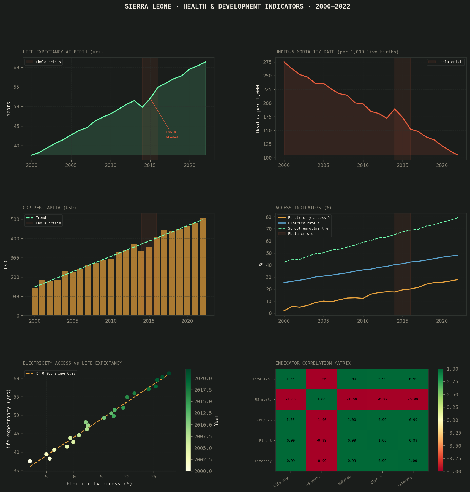

# 🏥 Sierra Leone Health & Development Indicators Dashboard (2000–2022)

A multi-indicator data analysis and visualization project tracking Sierra Leone's development progress across 22 years — covering health outcomes, economic growth, infrastructure access, and the measurable impact of the 2014 Ebola crisis.

---

## 📊 Key Findings

| Metric | Value |
|--------|-------|
| Life expectancy gain | **+23.8 years** (2000 → 2022) |
| Under-5 mortality reduction | **−170 deaths per 1,000** births |
| GDP per capita growth | **~3.6× increase** over study period |
| Electricity access | **2.0% → 27.9%** of population |
| Electricity ↔ Life expectancy | **R² = 0.98** (near-perfect correlation) |
| Ebola crisis impact (2014) | **−1.7 year** life expectancy drop |

---

## 📁 Project Structure

```
sierra-leone-development/
│
├── analysis.py            # Main analysis & SQL-style queries
├── health_analysis.png    # Output dashboard (6-panel figure)
├── README.md
└── data/
    └── README_data.txt    # Instructions to download real WDI data
```

---

## 🔍 What This Project Covers

- **SQL-style querying with pandas** — decade snapshots, Ebola impact windows, high-GDP-growth years
- **Regression analysis** — electricity access as a predictor of life expectancy (R² = 0.98)
- **Correlation matrix** — heatmap across 5 key development indicators
- **Ebola crisis impact analysis** — quantified setback across health and economic indicators (2013–2016)
- **Multi-indicator trend tracking** — life expectancy, under-5 mortality, GDP/capita, electricity, literacy, school enrollment, maternal mortality, health expenditure

---

## 📈 Visualizations



Six-panel dashboard:
1. Life expectancy trend (2000–2022) — Ebola dip highlighted
2. Under-5 mortality rate reduction
3. GDP per capita with growth trend
4. Access indicators (electricity, literacy, school enrollment)
5. Scatter plot — electricity access vs life expectancy (regression overlay)
6. Correlation heatmap across all indicators

---

## 🛠️ Tech Stack

| Tool | Purpose |
|------|---------|
| Python 3.x | Core language |
| Pandas | SQL-style queries, aggregation, joins |
| NumPy | Numerical computation |
| Scikit-learn | Linear regression |
| Matplotlib / Seaborn | Dashboard & heatmap visualization |

---

## 🔎 Sample SQL-Style Queries (pandas)

```python
# Decade snapshot
df[df["year"].isin([2000, 2010, 2022])][
    ["year", "life_expectancy", "under5_mortality", "gdp_per_capita"]
]

# Ebola impact window
df[df["year"].between(2013, 2016)][
    ["year", "life_expectancy", "gdp_per_capita", "health_expenditure"]
]

# High-growth years
df[df["gdp_growth"] > 10][["year", "gdp_per_capita", "gdp_growth"]]
```

---

## 🚀 How to Run

```bash
git clone https://github.com/Mamphia/sierra-leone-development
cd sierra-leone-development

pip install pandas numpy matplotlib seaborn scikit-learn

python analysis.py
```

### To use real World Bank data:
1. Go to [World Bank Data — Sierra Leone](https://data.worldbank.org/country/sierra-leone)
2. Download the World Development Indicators CSV
3. In `analysis.py`, replace `generate_data()` with:
   ```python
   df = pd.read_csv('WDI_Sierra_Leone.csv')
   ```

---

## 🌍 Context & Motivation

Sierra Leone has undergone dramatic transformation over 22 years — surviving a devastating civil war, the 2014 Ebola outbreak (which killed over 11,000 people across West Africa), and building toward sustained development. This project uses data to tell that story clearly.

The near-perfect correlation between electricity access and life expectancy (R²=0.98) points to infrastructure investment as a critical lever for health outcomes — a finding with direct policy relevance for the National Power Authority and Ministry of Health.

---

## 📬 Contact

[LinkedIn](https://www.linkedin.com/in/mamadu-jalloh-bb650a349/?lipi=urn%3Ali%3Apage%3Ad_flagship3_profile_view_base_contact_details%3BxLTXwNYhThWnOCgLpm7obw%3D%3D)
